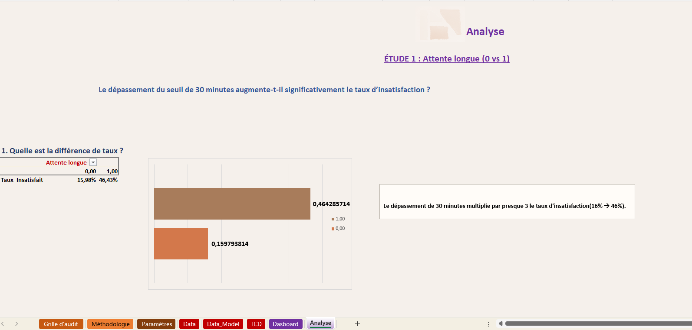

####  📊 Dashboard -- Analyse de l'Accessibilité & de l'Insatisfaction Usager

#####  🎯 Objectif du projet

Ce projet analyse l'accessibilité et la qualité d'accueil à partir de
**250 observations simulées** reproduisant des situations
opérationnelles réalistes en contexte de service public.

L'objectif est d'identifier : - Les facteurs explicatifs de
l'insatisfaction - Les seuils critiques (temps d'attente) - Les écarts
territoriaux - Les effets volume vs gravité - Les éventuels biais
d'échantillonnage

Le dashboard constitue un **outil d'aide à la décision structuré et
priorisé**.

------------------------------------------------------------------------

##### 🧠 Méthodologie

- Structuration et agrégation des données  
- Tableaux croisés dynamiques  
- Analyse d’effet seuil (variable binaire : délai > 30 minutes)  
- Corrélation de Pearson  
- Nuages de points avec droite de régression  
- Analyse Volume × Gravité  
- Vérification des biais d’échantillonnage  

------------------------------------------------------------------------

#####  🔍 Résultats des analyses

######  🔵 Étude 1 --- Effet seuil (\> 30 min)

Le dépassement du seuil de 30 minutes constitue un **facteur aggravant
majeur**.

-   Insatisfaction ≤ 30 min : \~16%
-   Insatisfaction \> 30 min : \~46%

👉 Le seuil agit comme un **point de bascule opérationnel**.

------------------------------------------------------------------------

######  🔵 Étude 2 --- Analyse territoriale

Relation moyenne d'attente / insatisfaction : R² ≈ 0,03 (faible)\
Proportion d'attentes longues / insatisfaction : R² ≈ 0,001 (quasi nul)

👉 Les différences territoriales relèvent d'un **système
multifactoriel**.

------------------------------------------------------------------------

######  🔵 Étude 3 --- Accessibilité & satisfaction

R² ≈ 0,71 → relation positive modérée à forte.

👉 L'accessibilité apparaît comme un **levier structurel stable**.

------------------------------------------------------------------------

######  🔵 Étude 4 --- Gravité vs volume

R² ≈ 0,52 → relation modérée.

👉 Le volume ne reflète pas nécessairement la gravité.

------------------------------------------------------------------------

###### 🔵 Étude 5 --- Vérification des biais

R² ≈ 0,945 entre taille d'échantillon et taux extrêmes.

👉 Interprétation prudente nécessaire.

------------------------------------------------------------------------

#####  🏆 Conclusion Générale

L'insatisfaction des usagers dépend de facteurs critiques identifiables.

Le seuil des 30 minutes constitue un **levier opérationnel
prioritaire**.

Cependant : - Les écarts territoriaux sont multifactoriels -
L'accessibilité joue un rôle structurant - Le volume ne reflète pas
toujours la gravité - Les tailles d'échantillon influencent
l'interprétation

Le dashboard constitue un **outil d'aide à la décision orienté pilotage
opérationnel**.

------------------------------------------------------------------------

#####   Enseignements stratégiques

- Les indicateurs moyens peuvent masquer des effets seuils.
- La fréquence d’un problème ne reflète pas toujours son impact.
- Une lecture multi-factorielle est nécessaire.
- L’analyse doit toujours être reliée à l’action.
------------------------------------------------------------------------

##### 📂 Structure du projet

- DATA.xlsx  
- README.md  
  - etude1.png  
  

------------------------------------------------------------------------

##### ⚠️ Limites

-   Données simulées à des fins pédagogiques
-   Corrélation ne signifie pas causalité directe
-   Taille d’échantillon limitée pour certaines comparaisons 
-   Analyse agrégée pouvant masquer des variations individuelles

------------------------------------------------------------------------

##### 🚀 Compétences mobilisées

-   Analyse statistique descriptive
-   Corrélation
-   Effet seuil
-   Lecture critique des R²
-   Visualisation sous Excel

------------------------------------------------------------------------

Projet réalisé dans un cadre pédagogique d'analyse statistique
appliquée.
